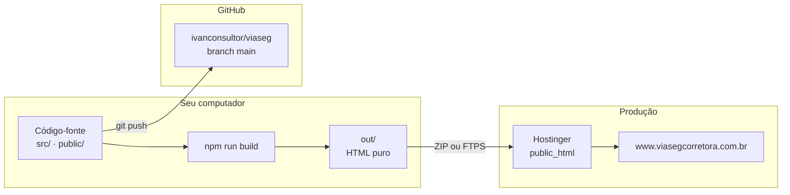
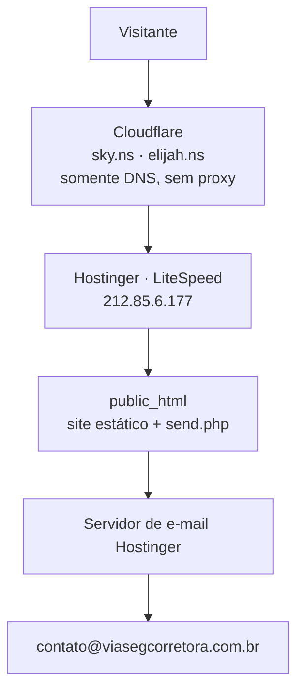
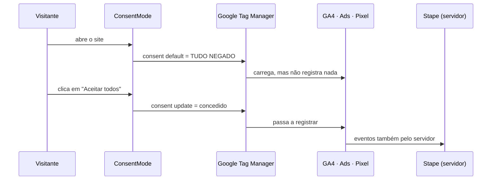
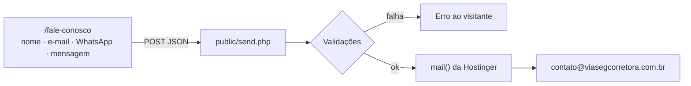
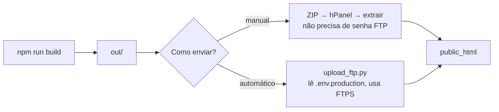

# Arquitetura — Site ViaSeg Corretora

> Mapa completo do projeto: do código-fonte até o rastreamento em produção.
> Documento de referência. Última revisão: 22/08/2026.

Para **o que** o site entrega, veja [PRD.md](PRD.md).
Para **como** foi construído em detalhe, veja [SPEC.md](SPEC.md).
Para regras de design e publicação, veja [AGENTS.md](AGENTS.md).

---

## 1. Visão em uma tela



O ponto que mais confunde: **GitHub e Hostinger recebem coisas diferentes.**
O GitHub guarda o **código-fonte** (a receita). A Hostinger recebe o **site
compilado** (o prato). A pasta `out/` é gerada a cada build e está no
`.gitignore` — nunca vai para o GitHub.

---

## 2. Como o projeto nasceu

| Momento | O que aconteceu |
|---|---|
| 2005 | Ivan atua como corretor de seguros (SUSEP 201096702) |
| 12/06/2026 | Projeto criado com `create-next-app` |
| 07/07/2026 | Último commit antes da consolidação — exportação estática ativada |
| 22/08/2026 | 45 dias de trabalho local consolidados; correções de segurança, SEO, rastreamento e documentação |

O domínio esteve hospedado na **HostGator** antes de migrar para a **Hostinger**.
Credenciais antigas foram removidas do projeto (ficaram em `_OBSOLETOS/`).

---

## 3. Stack

| Camada | Tecnologia |
|---|---|
| Framework | Next.js 16.2.9 (App Router, `output: 'export'`) |
| Interface | React 19.2.4 · TypeScript 5 |
| Estilo | Tailwind CSS 4 |
| Animação | Framer Motion 12 |
| Ícones | Lucide React |
| Formulário | React Hook Form + Zod |
| Servidor | Apache/LiteSpeed (hospedagem compartilhada) |
| Backend | PHP apenas para o envio de e-mail (`send.php`) |

Não há banco de dados, CMS nem servidor Node em produção. O site é HTML estático.

---

## 4. Mapa de pastas

```
C02 viaseg-corrigido/
│
├── README.md              porta de entrada
├── PRD.md                 o que o site entrega
├── SPEC.md                como foi construído
├── ARQUITETURA.md         este documento
├── AGENTS.md              regras de design e publicação
├── CLAUDE.md              aponta para o AGENTS.md
│
├── docs/
│   ├── Guia_Hostinger_Deploy.md
│   ├── Guia_Formulario_Contato.md
│   ├── SEO.md
│   └── referencias_design.md
│
├── src/
│   ├── app/                       uma pasta por rota
│   │   ├── layout.tsx             <head> global, JSON-LD, ordem do consentimento
│   │   ├── page.tsx               Home
│   │   ├── sitemap.ts             gera sitemap.xml no build
│   │   ├── robots.ts              gera robots.txt no build
│   │   ├── globals.css            paleta e trava de modo claro
│   │   ├── seguros/{auto,vida,residencial,empresarial}/
│   │   ├── {sobre,parceiros,cotacao,fale-conosco}/
│   │   └── {privacidade,termos,cookies}/
│   │
│   ├── components/
│   │   ├── ConsentMode.tsx        nega tudo antes de qualquer tag
│   │   ├── GoogleTagManager.tsx   carrega o GTM
│   │   ├── layout/{Header,Footer}.tsx
│   │   ├── sections/ParceirosSection.tsx
│   │   └── ui/{CookieConsent,BotaoGerenciarCookies}.tsx
│   │
│   └── lib/
│       ├── empresa.ts             SUSEP, endereço, contato, ano de atuação
│       ├── rastreamento.ts        GTM, chave liga/desliga, contas
│       └── utils.ts
│
├── public/                        copiado inteiro para out/ no build
│   ├── .htaccess                  HTTPS, www, URLs, 404, segurança, cache
│   ├── send.php                   processa o formulário de contato
│   └── images/
│       └── logo-seguradoras/      9 logos, fundo transparente
│
├── upload_ftp.py                  envio automático via FTPS
├── .env.producao.exemplo          modelo em branco das credenciais
└── out/                           GERADO pelo build — não versionado
```

---

## 5. Rotas do site

| Rota | Página | Prioridade no sitemap |
|---|---|---|
| `/` | Home | 1.0 |
| `/cotacao` | Cotação (links para seguradoras) | 0.9 |
| `/seguros/auto` | Seguro Auto | 0.8 |
| `/seguros/vida` | Seguro de Vida | 0.8 |
| `/seguros/residencial` | Seguro Residencial | 0.8 |
| `/seguros/empresarial` | Seguro Empresarial | 0.8 |
| `/parceiros` | Rede credenciada | 0.7 |
| `/sobre` | Institucional | 0.7 |
| `/fale-conosco` | Formulário de contato | 0.7 |
| `/privacidade` | LGPD | 0.3 |
| `/termos` | LGPD | 0.3 |
| `/cookies` | LGPD | 0.3 |

Todas geram `.html` na raiz do `out/`. O `.htaccess` faz `/cotacao` servir
`cotacao.html`, sem a extensão aparecer.

---

## 6. Infraestrutura



| Item | Valor |
|---|---|
| Domínio | viasegcorretora.com.br |
| Endereço oficial | **https://www.viasegcorretora.com.br** (sem www redireciona 301) |
| DNS | Cloudflare, modo somente-DNS |
| Hospedagem | Hostinger, painel hPanel, servidor LiteSpeed |
| SSL | ativo, HTTP → HTTPS forçado |
| Pasta de publicação | `public_html` |

---

## 7. Rastreamento

### Contas

| Ferramenta | Identificador |
|---|---|
| Google Tag Manager | `GTM-K8MXPGMJ` (contêiner "Web ViaSeg") |
| Google Analytics 4 | `G-WWDS8CMG8P` |
| Google Ads | `AW-17845467917` |
| Meta Pixel | `4860127807422598` ("Pixel GTM - API") |
| Conta de anúncios Meta | `3110020279309352` (ViaSeg Corretora) |
| Business Manager Meta | `248050633309906` |
| Servidor Stape | `server.viasegcorretora.com.br` |
| Search Console | propriedade de domínio + URL-prefix |

> **Não confundir:** `65956F` é o código interno do corretor na Porto Seguro,
> presente nos links de cotação. **Não é** o registro SUSEP, que é `201096702`.

### Fluxo do consentimento



**Ordem obrigatória no `<head>`:** `<ConsentMode />` sempre antes de
`<GoogleTagManagerHead />`. Invertendo, as tags disparam antes da decisão do
visitante — irregular perante a LGPD.

O visitante pode mudar de ideia depois pelo botão em `/cookies`, que reabre o
aviso.

### Onde mexer em cada coisa

| Quero... | Onde faço | Precisa de novo build? |
|---|---|---|
| Adicionar evento ou conversão | painel do GTM | **não** |
| Trocar o ID do GA4, Ads ou Pixel | painel do GTM | **não** |
| Desligar todo o rastreamento | `src/lib/rastreamento.ts` | sim |
| Carregar o GTM pelo Stape | `GTM_DOMINIO` em `rastreamento.ts` | sim |
| Liberar um domínio novo de medição | `public/.htaccess` (CSP) | sim |

**Armadilha:** domínio de rastreamento não liberado na CSP é bloqueado **em
silêncio** — nenhum erro aparece, simplesmente não registra. Foi o que
manteria o aviso "a tag parou de enviar dados" no GTM.

---

## 8. Formulário de contato



Proteções no `send.php`:

- remove quebras de linha de todos os campos (injeção de cabeçalho de e-mail);
- valida o e-mail de verdade antes de usar no `Reply-To`;
- aceita requisição apenas do próprio domínio;
- limita 5 envios por hora por IP;
- campo-armadilha invisível contra robôs;
- limite de tamanho em cada campo e no corpo da requisição.

Remetente: `no-reply@viasegcorretora.com.br`. Resposta vai para o e-mail do
visitante.

O `mail()` da Hostinger **nao usa senha**: entrega pela fila local do servidor.
Senha de caixa nao entra no `.env` nem em lugar nenhum do projeto.

Para funcionar, o dominio precisa de:

| Requisito | Estado em 23/08/2026 |
|---|---|
| Caixa `contato@viasegcorretora.com.br` criada | ok |
| Caixa `no-reply@viasegcorretora.com.br` criada | ok — sem ela a Hostinger recusa o envio |
| MX apontando para a Hostinger | ok (`mx2.hostinger.com`) |
| SPF autorizando a Hostinger | ok (`include:_spf.mail.hostinger.com`) |
| DMARC | presente, em modo observacao (`p=none`) |
| DKIM | **ausente** — ver Pendencias |

Envio real testado e confirmado no dominio em **23/08/2026**.

---

## 9. Segurança do site

Todos os cabeçalhos vivem em `public/.htaccess`.

> Com `output: 'export'`, o Next.js **ignora** a função `headers()` do
> `next.config.ts`. Se os cabeçalhos estiverem lá, o site fica sem proteção
> nenhuma e ninguém percebe.

| Cabeçalho | Efeito |
|---|---|
| `Content-Security-Policy` | define de onde scripts e imagens podem vir |
| `Strict-Transport-Security` | obriga HTTPS por 1 ano |
| `X-Frame-Options: DENY` | impede o site de ser embutido em iframe |
| `X-Content-Type-Options` | impede o navegador de adivinhar tipo de arquivo |
| `Referrer-Policy` | limita o que é enviado ao sair do site |
| `Permissions-Policy` | bloqueia câmera, microfone, localização e pagamento |

Também bloqueia acesso a `.env`, `.log`, `.sql` e `.zip`, e define cache longo
para imagens, CSS e JavaScript.

---

## 10. SEO

| Item | Situação |
|---|---|
| Endereço canônico | `https://www.viasegcorretora.com.br` em todas as páginas |
| Redirecionamento www | 301 no `.htaccess` — evita conteúdo duplicado |
| `sitemap.xml` | 12 endereços, data real por página |
| `robots.txt` | libera tudo, aponta o sitemap |
| Dados estruturados | JSON-LD `InsuranceAgency` no layout raiz |
| Metadados | título e descrição próprios por página |
| Imagens | WebP |

A data no sitemap é fixa por página em `src/app/sitemap.ts`. **Atualizar a data
apenas quando o conteúdo daquela página mudar de verdade** — carimbar a data do
build em tudo faz o Google desconfiar do sinal e passar a ignorá-lo.

---

## 11. Publicação



**Sempre conferir depois de gerar o ZIP:**

1. o `.htaccess` entrou? Começa com ponto e muitos compactadores o ignoram.
   Sem ele, todas as URLs quebram;
2. o conteúdo está na raiz do ZIP, não dentro de uma pasta `out`?
3. o `send.php` está presente? Sem ele o formulário para.

---

## 12. Pendências conhecidas

| Item | Onde |
|---|---|
| Liberar `pagead2.googlesyndication.com` e `capi-automation.s3.us-east-2.amazonaws.com` na CSP | `public/.htaccess` — hoje bloqueiam conversoes do Google Ads e a API de Conversoes da Meta |
| Publicar os 3 CNAME de DKIM da Hostinger | Cloudflare — sem eles o e-mail do dominio tem mais chance de cair no spam |
| Acrescentar `mx1.hostinger.com` como MX secundario | Cloudflare — hoje so existe o `mx2`, sem redundancia |
| Adicionar propriedade **com www** no Search Console e enviar o sitemap | painel do Google |
| Conferir origem dos eventos do Pixel disparados fora do site | Gerenciador de Eventos da Meta |
| Preencher credenciais da Hostinger em `.env.production` | para usar o envio automático |
| Revisão jurídica dos textos legais | opcional; textos já ancorados na LGPD e no CDC |
| 3 erros de lint em `SafeShadowBoundary.tsx` | anteriores à consolidação, não bloqueiam o build |
